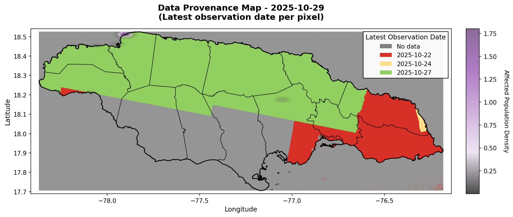
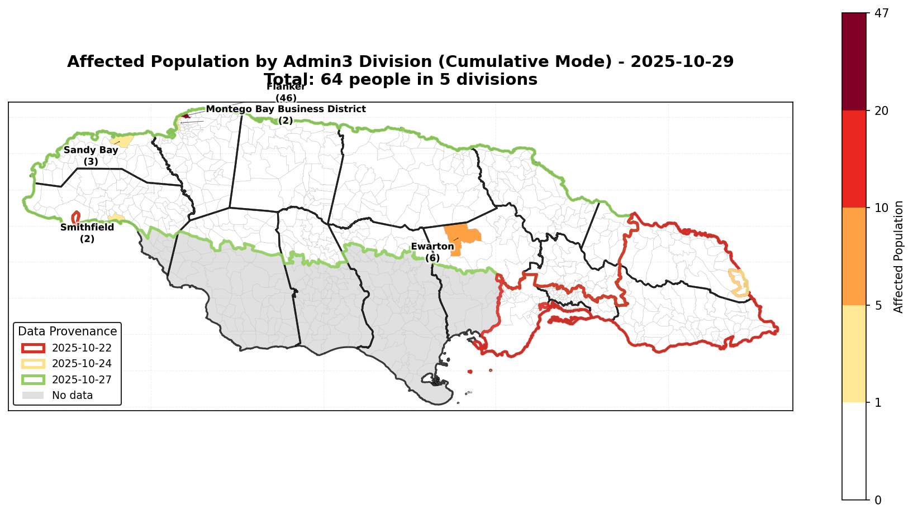
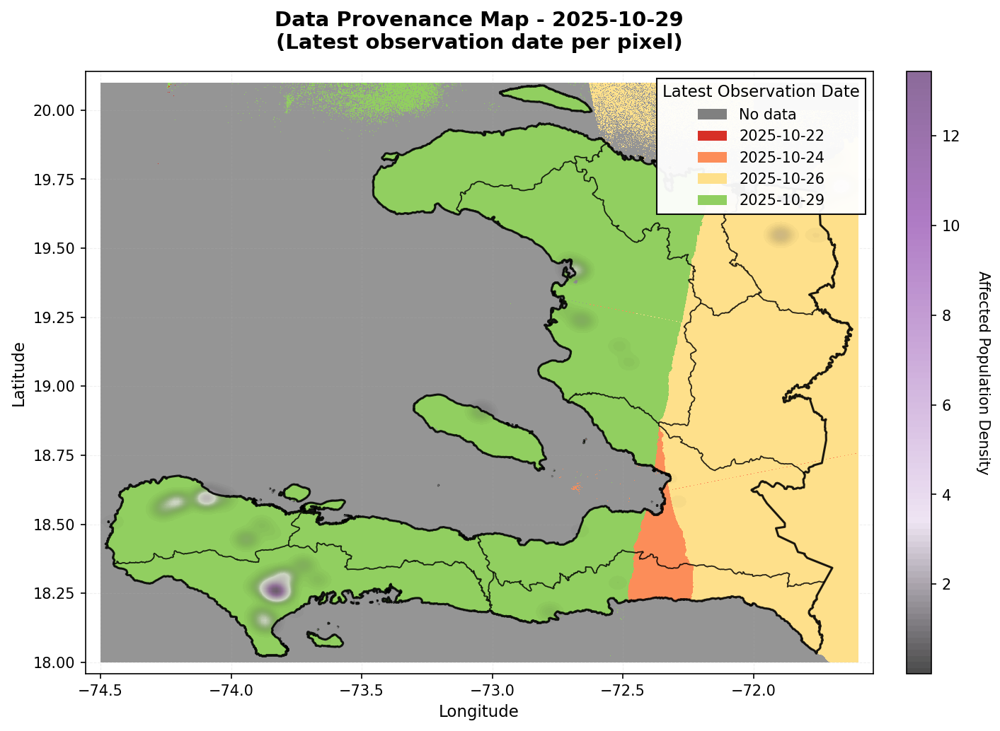
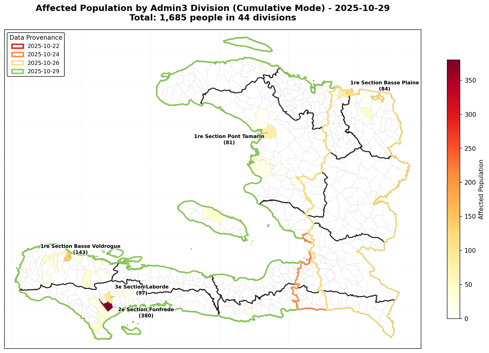
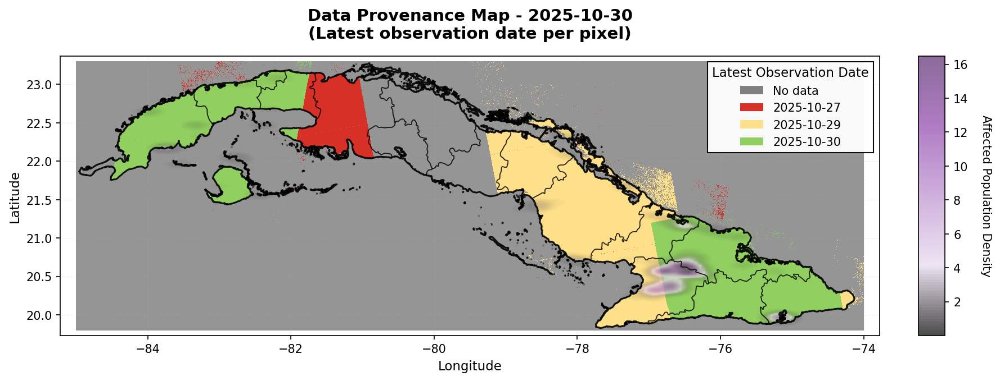
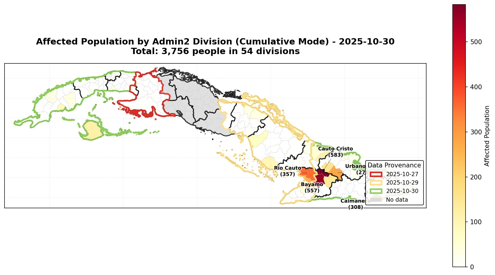
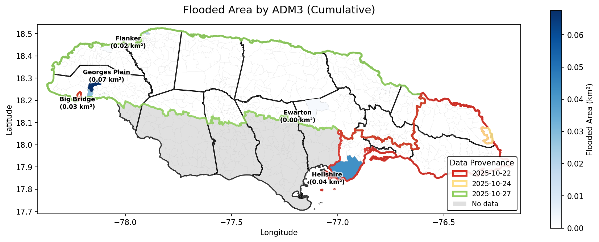
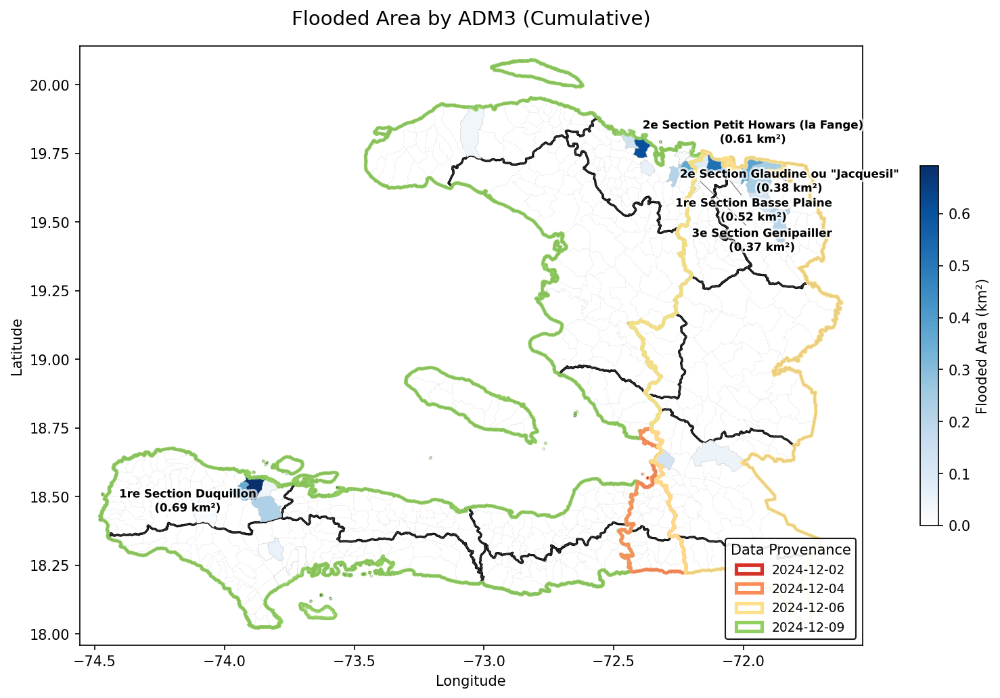

# The Production Pipeline {#sec-production-pipeline}

---
jupyter: ds-flood-gfm
execute:
  eval: false
---

The concepts from the previous chapters --- STAC queries, temporal compositing, provenance tracking, and population overlay --- are automated by four CLI scripts in the `scripts/` directory. This chapter walks through the pipeline, shows the actual command-line calls, and showcases the outputs.

```{python}
import geopandas as gpd
import matplotlib.pyplot as plt
import matplotlib.patches as mpatches
import numpy as np
import pandas as pd
import ocha_stratus as stratus
from ocha_stratus import list_container_blobs, load_blob_data
from ds_flood_gfm.geo_utils import generate_rdylgn_colors

%matplotlib inline
plt.rcParams['figure.dpi'] = 100
```


## Pipeline Overview

The pipeline has four scripts, run in order:

| Script | Purpose | Runtime |
|--------|---------|---------|
| `01_download_codab_to_blob.py` | Download admin boundaries to blob (one-time setup) | ~30s |
| `02_generate_affected_population_choropleths.py` | Query STAC, composite, population overlay, choropleths | ~4-50 min (country-dependent) |
| `03_generate_flooded_area_choropleths.py` | Generate flooded area (km^2^) choropleths from cache | ~30s |
| `04_generate_flood_polygons.py` | Raster-to-vector conversion, export to blob | ~5-20 min |

Scripts 02 and 03 produce PNG choropleths. Script 04 produces vector polygons and provenance rasters as COGs, uploaded to Azure Blob Storage.


## Script 01: Download Admin Boundaries

One-time setup to cache COD-AB (Common Operational Datasets - Administrative Boundaries) in blob storage for fast access.

```bash
uv run python scripts/01_download_codab_to_blob.py
```

This downloads admin levels 1-3 from FieldMaps.io for configured countries (Jamaica, Haiti, Cuba) and uploads them as parquet files to blob. The blob structure:

```
ds-flood-gfm/raw/codab/{iso3_lower}/{iso3_lower}_adm{level}.parquet
```


## Script 02: Affected Population Choropleths

The main analysis script. It queries STAC, builds composites, overlays with population data, and generates choropleth visualizations.

### CLI Interface

```bash
uv run python scripts/02_generate_affected_population_choropleths.py \
  --end-date 2025-10-29 \
  --n-latest 4 \
  --iso3 JAM \
  --flood-mode latest
```

| Argument | Default | Description |
|----------|---------|-------------|
| `--end-date` | *required* | Latest date to search back from (YYYY-MM-DD) |
| `--n-latest` | 3 | Number of most recent observation dates to use |
| `--iso3` | JAM | Country code (JAM, HTI, CUB) |
| `--flood-mode` | latest | `latest` (current state) or `cumulative` (total footprint) |
| `--cache-dir` | `data/cache` | Cache directory |
| `--no-cache` | false | Force recompute, skip cache |

### Workflow

Running with `--flood-mode latest`:

```bash
uv run python scripts/02_generate_affected_population_choropleths.py \
  --end-date 2025-10-29 \
  --n-latest 4 \
  --iso3 JAM \
  --flood-mode latest
```

Then again with `--flood-mode cumulative`:

```bash
uv run python scripts/02_generate_affected_population_choropleths.py \
  --end-date 2025-10-29 \
  --n-latest 4 \
  --iso3 JAM \
  --flood-mode cumulative
```

**Runtime:** Jamaica ~4-5 min first run, ~46 sec cached. Haiti ~15-20 min. Cuba ~45-60 min.

### Outputs

Each run produces:

- `{ISO3}_population_provenance_{YYYYMMDD}.png` --- density heatmap with provenance overlay
- `{ISO3}_population_{mode}_adm3_{YYYYMMDD}.png` --- affected population choropleth


### The Smart Cache System

The cache key is generated from the **actual satellite observation dates** returned by STAC, not the query parameters. This means:

::: {.callout-tip}
## Cache invalidation by observation, not query

**Same satellite data** --- if you query up to Oct 27 and find dates [Oct 22, 24, 27], then query up to Oct 28 and find the same three dates, the cache key is identical. The second run uses cache (~46 sec vs ~4 min).

**New observation arrives** --- if you query up to Oct 29 and find dates [Oct 24, 27, 29], the cache key changes and the composite is rebuilt with the new data.
:::


### Script 02 Output Gallery

These maps are the direct output of Script 02. Each country gets a provenance density heatmap and an affected population choropleth.

::: {layout-ncol=2}



:::

::: {layout-ncol=2}



:::

::: {layout-ncol=2}



:::


## Script 03: Flooded Area Choropleths

Reads cached flood points from Script 02 and generates flooded area maps.

```bash
uv run python scripts/03_generate_flooded_area_choropleths.py \
  --end-date 2025-10-29 \
  --n-latest 4 \
  --iso3 JAM
```

**Prerequisite:** Must have run Script 02 in **both** `latest` and `cumulative` modes first.

**Outputs:**

- `{ISO3}_choropleth_flooded_area_latest_{YYYYMMDD}.png` --- km^2^ per admin division
- `{ISO3}_choropleth_flooded_area_cumulative_{YYYYMMDD}.png`

::: {layout-ncol=2}



:::


## Script 04: Flood Polygons

Converts raster composites to vector polygons with provenance metadata and uploads to blob.

### CLI Interface

```bash
# Standard country run
uv run python scripts/04_generate_flood_polygons.py \
  --target-date 2025-10-29 \
  --n-images 4 \
  --iso3 JAM \
  --flood-mode cumulative

# Custom geometry from blob (e.g., Gaza Strip)
uv run python scripts/04_generate_flood_polygons.py \
  --target-date 2025-11-14 \
  --n-images 4 \
  --aoi-geom-blob ds-flood-gfm/raw/geom/gaza_strip_adm1.parquet \
  --flood-mode cumulative

# Large country with spatial tiling
uv run python scripts/04_generate_flood_polygons.py \
  --target-date 2025-11-05 \
  --n-images 4 \
  --iso3 CUB \
  --flood-mode cumulative \
  --use-tiling \
  --tile-size 2.0
```

| Argument | Default | Description |
|----------|---------|-------------|
| `--target-date` | *required* | Reference date (YYYY-MM-DD) |
| `--n-images` | 4 | Number of dates for composite |
| `--n-search` | -15 | Search window in days. Negative = backward, positive = forward |
| `--iso3` | --- | Country code (mutually exclusive with `--aoi-geom-blob`) |
| `--aoi-geom-blob` | --- | Blob path to custom geoparquet AOI |
| `--flood-mode` | latest | `latest` or `cumulative` |
| `--use-tiling` | false | Enable spatial tiling for large countries |
| `--tile-size` | 2.0 | Tile size in degrees |


## What's on Blob Storage

The pipeline uploads outputs to Azure Blob Storage. Here's an inventory of what's available:

```{python}
# List all processed outputs on blob
blobs = list_container_blobs(
    name_starts_with='ds-flood-gfm/processed/',
    stage='dev',
    container_name='projects'
)

# Categorize
polygons = [b for b in blobs if '/polygon/' in b and b.endswith('.shp.zip')]
provenance = [b for b in blobs if '/provenance_raster/' in b and b.endswith('.tif')]
pop_csv = [b for b in blobs if '/exposed_population/' in b and b.endswith('.csv')]
cache = [b for b in blobs if '/cache/' in b]

print(f"Flood polygon shapefiles: {len(polygons)}")
print(f"Provenance rasters (COG): {len(provenance)}")
print(f"Exposed population CSVs:  {len(pop_csv)}")
```

### Polygon Inventory

```{python}
print("Available flood polygon exports:\n")
for p in sorted(polygons):
    name = p.split('/polygon/')[-1]
    print(f"  {name}")
```

### Countries and Geometries Covered

```{python}
# Extract unique AOIs from polygon names
aois = set()
for p in polygons:
    name = p.split('/polygon/')[-1]
    # Extract prefix before first date
    parts = name.split('_')
    # ISO3 codes are 3 chars, custom geoms are longer
    aoi = parts[0]
    if len(parts) > 1 and not parts[1][0].isdigit():
        aoi = f"{parts[0]}_{parts[1]}"
    aois.add(aoi)

print("Areas of interest with polygon outputs:")
for aoi in sorted(aois):
    n = len([p for p in polygons if f'/polygon/{aoi}_' in p or f'/polygon/{aoi}' in p.split('/')[-1]])
    print(f"  {aoi}: {n} exports")
```


## Loading and Visualizing Polygon Outputs

The flood polygons can be loaded from blob and visualized with provenance coloring.

```{python}
#| cache: true

import tempfile, zipfile, os

# Load a Jamaica polygon export
jam_polygons = [p for p in polygons if p.startswith('ds-flood-gfm/processed/polygon/JAM_')]
if jam_polygons:
    # Use the most recent cumulative export
    cumulative = [p for p in jam_polygons if 'cumulative' in p]
    if cumulative:
        blob_path = sorted(cumulative)[-1]
        print(f"Loading: {blob_path}")

        # Download the zip and find the .shp file inside
        zip_data = stratus.load_blob_data(blob_path, container_name='projects', stage='dev')
        with tempfile.TemporaryDirectory() as tmpdir:
            zip_path = os.path.join(tmpdir, "flood.shp.zip")
            with open(zip_path, 'wb') as f:
                f.write(zip_data)
            with zipfile.ZipFile(zip_path) as zf:
                zf.extractall(tmpdir)
                shp_files = [f for f in zf.namelist() if f.endswith('.shp')]
                if shp_files:
                    gdf_polygons = gpd.read_file(os.path.join(tmpdir, shp_files[0]))

        print(f"Loaded {len(gdf_polygons)} polygons")
        print(f"Columns: {list(gdf_polygons.columns)}")
```

```{python}
#| cache: true

from fsspec.implementations.http import HTTPFileSystem

if 'gdf_polygons' in dir() and gdf_polygons is not None and len(gdf_polygons) > 0:
    # Load country outline for context
    GLOBAL_ADM1 = (
        "https://data.fieldmaps.io/edge-matched/humanitarian/intl/adm1_polygons.parquet"
    )
    filesystem = HTTPFileSystem()
    gdf_jam = gpd.read_parquet(GLOBAL_ADM1, filesystem=filesystem,
                                filters=[("iso_3", "=", "JAM")]).dissolve()

    fig, ax = plt.subplots(1, 1, figsize=(14, 8))

    # Country outline
    gdf_jam.plot(ax=ax, color='#f5f5f5', edgecolor='black', linewidth=1.5)

    # Flood polygons
    gdf_flood = gdf_polygons[gdf_polygons.geometry.notnull()]
    if 'prov_date' in gdf_flood.columns:
        # Color by provenance date
        unique_dates = sorted(gdf_flood['prov_date'].dropna().unique())
        colors = generate_rdylgn_colors(len(unique_dates))
        date_to_color = dict(zip(unique_dates, colors))

        for date, color in date_to_color.items():
            subset = gdf_flood[gdf_flood['prov_date'] == date]
            subset.plot(ax=ax, color=color, edgecolor=color, linewidth=0.5, alpha=0.7)

        legend_patches = [mpatches.Patch(color=c, label=d) for d, c in date_to_color.items()]
        ax.legend(handles=legend_patches, title='Provenance Date', loc='upper left',
                  fontsize=9, title_fontsize=10)
    else:
        gdf_flood.plot(ax=ax, color='darkblue', edgecolor='darkblue',
                       linewidth=0.5, alpha=0.7)

    ax.set_title(f"Flood Polygons - Jamaica (Cumulative)\n{blob_path.split('/')[-1]}",
                 fontsize=12, fontweight='bold')
    ax.set_xlabel('Longitude')
    ax.set_ylabel('Latitude')

    plt.tight_layout()
    plt.show()
```


## Interactive Dashboard: `flood_exposure.py`

The flood polygon outputs from Script 04 feed into an interactive [marimo](https://marimo.io) dashboard (`flood_exposure.py`) that provides a self-service interface for exploring flood exposure.

```bash
uv run marimo run flood_exposure.py
```

### What the Dashboard Does

The dashboard consumes the polygon shapefiles from blob and performs its own exposure calculation:

1. **Select data** --- dropdown menus for country (JAM, HTI, CUB, PHL, Gaza, Niger), admin level, and which polygon shapefile to analyze
2. **Configure buffer** --- adjustable buffer distance (0-1000m) around flood polygons to account for uncertainty
3. **Compute exposure** --- loads GHSL population raster, creates a flood mask from the polygons, runs `exactextract` zonal statistics per admin division
4. **Interactive choropleth** --- Plotly map with hover tooltips showing population exposed per division, color-scaled with 99th percentile clamping
5. **Sanity check** --- drill into any admin division to see the population raster, flood polygons, and buffer overlay side-by-side
6. **Export** --- toggle to save the exposure CSV to blob storage

### Data Flow

```
Script 04 (generate polygons)
    ↓ uploads to blob
ds-flood-gfm/processed/polygon/{ISO3}_*.shp.zip
    ↓ marimo app loads
flood_exposure.py (interactive analysis)
    ↓ exports to blob
ds-flood-gfm/processed/exposed_population/{ISO3}_*.csv
```

The exported CSVs contain per-admin-division exposure estimates (`adm3_name`, `adm3_src`, `pop_exposed`) and are named with the observation dates, flood mode, and buffer distance --- for example: `JAM_20251103_20251104_20251105_cumulative_b50.csv`.


### Multi-Country Exposure Gallery

Here we reproduce the marimo dashboard's choropleth for Jamaica, Haiti, and Cuba using the exported CSVs from blob. This uses the `exposure_choropleth` helper defined in @sec-population-exposure.

```{python}
import io
import plotly.express as px
from fsspec.implementations.http import HTTPFileSystem

FIELDMAPS_BASE = "https://data.fieldmaps.io/edge-matched/humanitarian/intl"
filesystem = HTTPFileSystem()

def load_exposure_csv(blob_path):
    data = stratus.load_blob_data(blob_path, container_name='projects', stage='dev')
    return pd.read_csv(io.BytesIO(data))

def load_admin_boundaries(iso3, adm_level):
    url = f"{FIELDMAPS_BASE}/adm{adm_level}_polygons.parquet"
    return gpd.read_parquet(url, filesystem=filesystem,
                            filters=[("iso_3", "=", iso3)])

def exposure_choropleth(df_exposure, gdf_adm, adm_level, title, pop_col='pop_exposed'):
    name_col = f'adm{adm_level}_name'
    src_col = f'adm{adm_level}_src'
    merge_col = src_col if src_col in df_exposure.columns and src_col in gdf_adm.columns else name_col
    gdf_merged = gdf_adm.merge(df_exposure, on=merge_col, how='left')
    if f'{name_col}_x' in gdf_merged.columns:
        gdf_merged[name_col] = gdf_merged[f'{name_col}_x']
    gdf_merged[pop_col] = gdf_merged[pop_col].fillna(0)

    gdf_plot = gdf_merged.copy()
    gdf_plot.geometry = gdf_plot.geometry.simplify(tolerance=0.001)
    gdf_wgs84 = gdf_plot.to_crs("EPSG:4326") if gdf_plot.crs != "EPSG:4326" else gdf_plot

    bounds = gdf_wgs84.total_bounds
    max_color = gdf_wgs84[pop_col].quantile(0.99)
    total = int(gdf_wgs84[pop_col].sum())
    n_div = int((gdf_wgs84[pop_col] > 0).sum())

    fig = px.choropleth_map(
        gdf_wgs84, geojson=gdf_wgs84.geometry, locations=gdf_wgs84.index,
        color=pop_col,
        color_continuous_scale=[
            (0, "white"), (0.001, "white"),
            (0.001, "#fee5d9"), (1, "#a50f15"),
        ],
        range_color=[0, max(max_color, 1)],
        zoom=6,
        center={"lat": (bounds[1] + bounds[3]) / 2,
                "lon": (bounds[0] + bounds[2]) / 2},
        hover_name=name_col,
        hover_data={pop_col: ":,.0f"},
        height=500,
    )
    fig.update_traces(marker_line_color="lightgrey", marker_line_width=0.5)
    fig.update_layout(title=f"{title}<br><sup>Total: {total:,} people in {n_div} divisions</sup>")
    return fig
```

#### Jamaica

```{python}
df_jam = load_exposure_csv(
    'ds-flood-gfm/processed/exposed_population/JAM_20251029_20251030_20251102_20251103_cumulative_b50.csv'
)
gdf_jam = load_admin_boundaries('JAM', 3)

fig = exposure_choropleth(df_jam, gdf_jam, 3,
    "Jamaica - Hurricane Melissa (Cumulative, 50m buffer)")
fig.show()
```

#### Haiti

```{python}
df_hti = load_exposure_csv(
    'ds-flood-gfm/processed/exposed_population/HTI_20251027_20251029_20251030_20251031_cumulative_b50.csv'
)
gdf_hti = load_admin_boundaries('HTI', 2)

fig = exposure_choropleth(df_hti, gdf_hti, 2,
    "Haiti - Hurricane Melissa (Cumulative, 50m buffer)")
fig.show()
```

#### Cuba

```{python}
df_cub = load_exposure_csv(
    'ds-flood-gfm/processed/exposed_population/CUB_20251104_20251105_20251106_cumulative_b50.csv'
)
gdf_cub = load_admin_boundaries('CUB', 3)

fig = exposure_choropleth(df_cub, gdf_cub, 3,
    "Cuba - Hurricane Melissa (Cumulative, 50m buffer)")
fig.show()
```


## Blob Storage Structure

For reference, the full blob layout:

```
ds-flood-gfm/
├── raw/
│   ├── codab/{iso3}/          # Admin boundaries (parquet)
│   └── geom/                  # Custom geometries (geoparquet)
├── processed/
│   ├── polygon/               # Flood polygon shapefiles   ← Script 04 output
│   ├── provenance_raster/     # Provenance COGs            ← Script 04 output
│   ├── exposed_population/    # Population CSV exports     ← Marimo app output
│   └── cache/{iso3}/          # Cached intermediate data   ← Script 02 cache
├── plots/                     # Choropleth PNGs            ← Scripts 02/03 output
└── jrc/                       # JRC reference data
```
